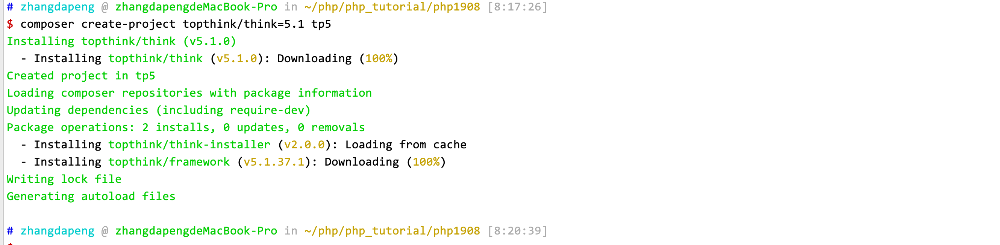
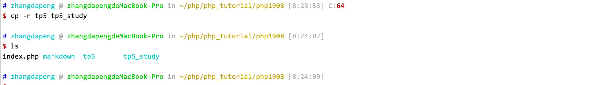
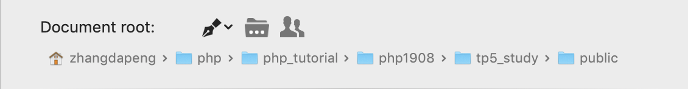
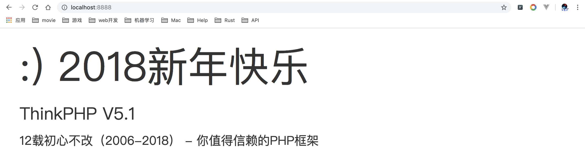

# TP5 入门教程

> 作者: 张大鹏
>
> 时间: 2019年8月4日


## 001.安装composer

```
curl -sS https://getcomposer.org/installer | php
mv composer.phar /usr/local/bin/composer
```


## 002.修改composer镜像源

```
composer config -g repo.packagist composer https://packagist.phpcomposer.com
```


## 003.使用composer安装tp5.1

```
composer create-project topthink/think=5.1 tp5 
```




## 004.复制源码

```
cp -r tp5 tp5_study
```




## 005.将public目录设置为网站根目录




## 006.启动服务器测试

浏览器访问`localhost:8888`



出现如图页面则说明部署成功